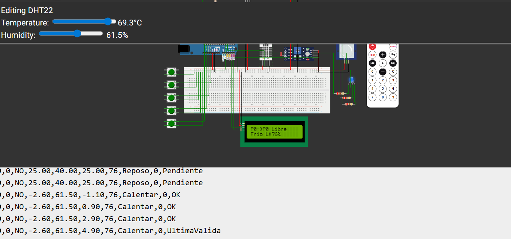
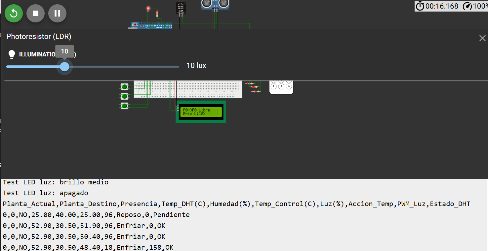
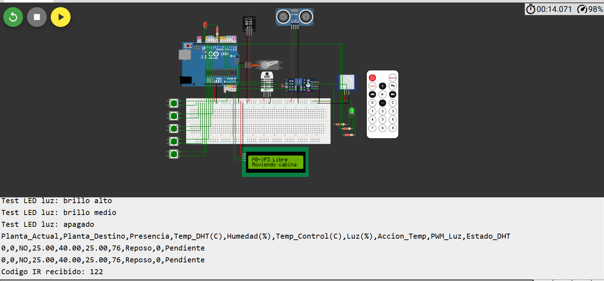
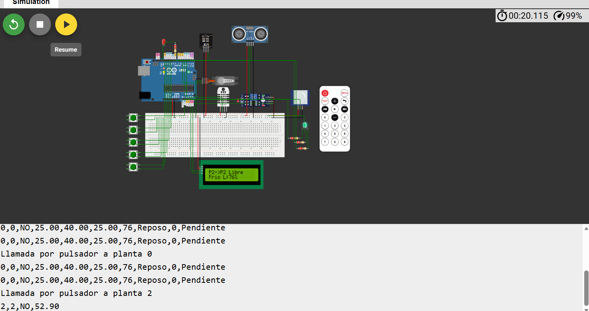
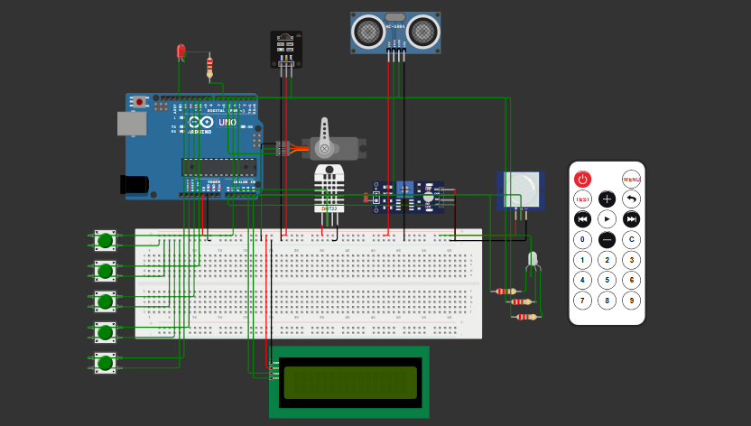
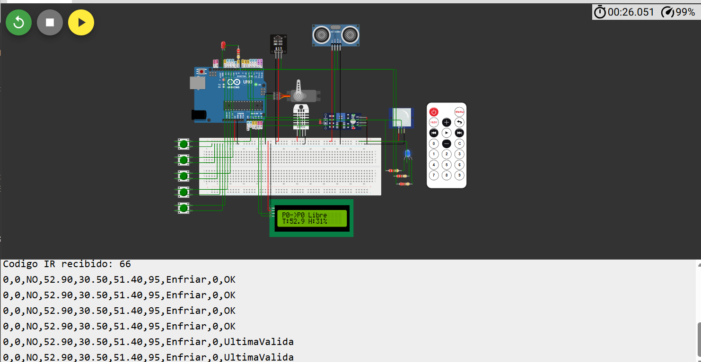

# 🧠 Actividad 3 – Equipos e Instrumentación Electrónica  
Repositorio del Proyecto del Grupo 32 de Equipamiento e Instrumentación Electrónica del Máster en Telecomunicaciones de UNIR. Implementación, simulación y documentación del sistema de control remoto IR para el ascensor inteligente ACME.

---

## 📘 Introducción
Este proyecto corresponde a la Actividad 3 de la asignatura Equipos e Instrumentación Electrónica (UNIR). El objetivo principal es implementar una mejora funcional basada en control remoto por infrarrojos (IR), permitiendo ajustar consignas del sistema sin modificar físicamente el circuito. El repositorio recoge el código, las pruebas realizadas y la documentación técnica del Grupo 32.

---

## 🎯 Objetivos
- Desarrollar la mejora funcional propuesta (control remoto mediante infrarrojos) sobre el diseño planteado en la Actividad 2.
- Registrar y validar las órdenes enviadas desde el mando y su correcta aplicación.
- Desarollar diferentes pruebas para garantizar el correcto funcionamiento, así como detectar los posibles problemas, de dicha mejora.
- Documentar el valor añadido de la mejora y su impacto en la ergonomía y flexibilidad del sistema.

---

## 🧩 Descripción técnica
La mejora permite ajustar variables de control sin modificar físicamente el circuito, convirtiendo el mando IR en un elemento de supervisión y parametrización remota. El sistema mantiene compatibilidad con versiones anteriores y no requiere sustituir sensores ni actuadores.

**Componentes principales:**

- **Microcontrolador Arduino Uno**: Encargado del procesamiento y control general.
  
- **Receptor IR**: Recibe las órdenes remotas enviadas por el mando infrarrojo para la selección de plantas y la modificación de parámetros de funcionamiento.
  
- **Fotorresistor LDR**: Conectado a una entrada analógica del Arduino, permite determinar el nivel de iluminación existente en el entorno.
  
- **Sensor digital de humedad y temperatura DHT22**: Conectado al pin digital D3, proporciona las medidas de temperatura y humedad utilizadas por el sistema de control ambiental.
  
- **Sensor de movimiento PIR**: Permite detectar la presencia de personas en las proximidades del ascensor, activando determinadas funciones de iluminación y operación.
  
- **Servomotor**: Conectado al pin PWM correspondiente, simula el desplazamiento del ascensor entre las diferentes plantas.
  
- **Monitor LCD 16x2 (IC2)**: Conectada mediante el bus I2C (SDA y SCL), muestra información relativa a la planta actual, temperatura, humedad y mensajes generados por el sistema.
  
- **Pulsadores táctiles 12mm**: Los pulsadores permiten seleccionar manualmente la planta de destino cuando no se utiliza el mando a distancia.
  
- **LED RGB**: Indica visualmente el estado ambiental mediante distintos colores asociados a las condiciones de funcionamiento.
  
- **LED de iluminación**: Representa el sistema de iluminación controlado automáticamente según las condiciones detectadas por los sensores. 

---

## ⚙️ Justificación de la mejora aplicada y valor añadido

Se ha elegido la variante de control remoto IR por tres motivos principales. En primer lugar, se trata de una tecnología ya integrada parcialmente en la Actividad 2, por lo que su incorporación avanzada requiere una adaptación progresiva del sistema y no un rediseño completo del montaje. En segundo lugar, el uso del mando IR permite mejorar la ergonomía del sistema, ya que el usuario puede modificar parámetros sin interactuar físicamente con el circuito. Por último, esta solución se ajusta a la filosofía de instrumentación avanzada descrita en la actividad, donde se busca perfeccionar el sistema de medición, control, actuación y presentación mediante técnicas modernas de interacción. 

Frente a otras alternativas, como la comunicación Bluetooth o la lógica fuzzy, el control remoto por infrarrojos presenta una implementación más directa en Wokwi y evita la necesidad de incorporar módulos adicionales. La lógica fuzzy se considera una opción interesante para una evolución futura, pero en esta actividad se ha priorizado una mejora funcional, estable y coherente con el sistema ya construido. El autodiagnóstico también podría aportar fiabilidad adicional, pero se ha decidido reservarlo como posible ampliación posterior, ya que el sistema ya incluye una lectura robusta del DHT22 mediante conservación de la última medida válida. 

Por tanto, la variante seleccionada permite mejorar el sistema manteniendo una complejidad razonable, aprovechando componentes ya presentes y reforzando el carácter remoto e interactivo del ascensor inteligente. 

La mejora mediante control remoto IR aporta una evolución clara respecto a la Actividad 2. En la versión anterior, el mando a distancia se utilizaba únicamente para seleccionar la planta de destino. En esta nueva fase, el mando se convierte en un elemento de supervisión y parametrización remota, permitiendo ajustar variables de control sin modificar físicamente el circuito. 

Esta mejora incrementa la ergonomía del sistema, ya que permite actuar sobre el ascensor desde el exterior. También mejora la flexibilidad, puesto que los valores de consigna pueden adaptarse a diferentes condiciones ambientales o necesidades de uso. Además, mantiene la compatibilidad con el sistema existente, ya que no requiere sustituir sensores ni actuadores. 

En resumen, la variante seleccionada permite perfeccionar el ascensor inteligente ACME mediante una funcionalidad sencilla, estable y directamente relacionada con la instrumentación avanzada: la modificación remota de parámetros de control. Esta solución mantiene la estructura de medición, control, actuación y visualización ya desarrollada, pero añade una capa adicional de interacción remota que mejora el valor funcional del sistema. 

---

## 🛠️ Integración de la mejora
La integración de la mejora avanzada se ha realizado sobre el sistema desarrollado previamente en las actividades anteriores, manteniendo todas las funcionalidades implementadas y añadiendo nuevas capacidades de control remoto mediante tecnología infrarroja y detección de obstáculos mediante sensor ultrasónico. 

El sistema conserva los elementos de medida, control, actuación y visualización ya desarrollados. Se mantienen el sensor DHT22 para la medición de temperatura y humedad, el sensor LDR para la supervisión del nivel de iluminación, el sensor PIR para la detección de presencia, el servomotor encargado de simular el desplazamiento entre plantas, los pulsadores de selección manual y la pantalla LCD I2C utilizada como interfaz local de usuario. 

La incorporación del receptor infrarrojo se ha realizado sin modificar la arquitectura principal del sistema. Este dispositivo se conecta al pin digital D2 del Arduino y permite recibir órdenes procedentes del mando a distancia. De esta forma, el usuario dispone de una segunda vía de interacción además de los pulsadores físicos ya existentes, pudiendo seleccionar plantas y modificar determinados parámetros del sistema de forma remota. 

Como mejora adicional, se ha incorporado un sensor ultrasónico HC-SR04 destinado a incrementar la seguridad de funcionamiento del ascensor. Este sensor permite medir la distancia existente frente a la puerta simulada y detectar la presencia de objetos u obstáculos que puedan interferir con el movimiento normal del sistema. 

La integración del sensor ultrasónico se ha realizado mediante la lectura continua de la distancia detectada. Cuando el sistema identifica un objeto situado a menos de 20 cm, se considera que existe un obstáculo y el movimiento del ascensor queda temporalmente bloqueado. En esta situación se muestra un mensaje de advertencia en la pantalla LCD indicando la presencia del obstáculo y el sistema permanece en espera hasta que la zona vuelve a quedar libre. 

La integración se ha llevado a cabo garantizando la compatibilidad con todas las funciones desarrolladas anteriormente. Los pulsadores continúan permitiendo la selección manual de plantas, mientras que el mando IR añade la posibilidad de realizar las mismas acciones de forma remota. El nuevo sistema de detección de obstáculos actúa de forma complementaria, aumentando la seguridad sin alterar el funcionamiento normal del ascensor. 

El algoritmo de control de temperatura mantiene su estructura ON-OFF con zona muerta, mientras que el sistema de iluminación continúa utilizando la información proporcionada por el sensor LDR para adaptar el funcionamiento del alumbrado. Asimismo, la mejora implementada permite modificar las consignas de funcionamiento sin necesidad de acceder físicamente al circuito ni alterar el código fuente. 

La pantalla LCD sigue desempeñando la función de interfaz hombre-máquina local, mostrando la planta seleccionada, las variables ambientales, los cambios realizados mediante el mando a distancia y los mensajes de seguridad relacionados con la detección de obstáculos. Del mismo modo, el monitor serie registra los eventos generados por el sistema, facilitando la supervisión y la verificación del funcionamiento. 

Gracias a esta integración se obtiene un sistema más completo, flexible y seguro, manteniendo la estructura original del ascensor inteligente ACME e incorporando capacidades adicionales de interacción remota y protección frente a obstáculos, mejorando así las prestaciones globales de la instalación. 

---
## ▶️ Ejecución

El ascensor dispone de cinco plantas, numeradas de 0 a 4. Cada planta se asocia a una posición angular del servomotor: planta 0 a 0°, planta 1 a 45°, planta 2 a 90°, planta 3 a 135° y planta 4 a 180°.

Las llamadas pueden realizarse mediante pulsadores físicos o mediante el mando IR. Las teclas 0, 1, 2, 3 y 4 del mando envían el ascensor a las plantas correspondientes.

El sensor PIR detecta si existe presencia en la cabina. El sensor DHT22 mide temperatura y humedad, mientras que el LDR mide el nivel de iluminación ambiental.

El sistema aplica un control ON-OFF con zona muerta para la temperatura. La consigna se fija en 25 °C con una zona muerta de ±2 °C. Si la temperatura es baja, se activa la acción de calentamiento y el RGB se muestra en rojo. Si la temperatura está dentro del rango aceptable, el sistema permanece en reposo y el RGB se muestra en verde. Si la temperatura es alta, se activa la acción de enfriamiento y el RGB se muestra en azul.

La iluminación artificial se controla mediante PWM. Cuando la luz ambiental baja por debajo del umbral, el LED de iluminación aumenta su intensidad.

Además de las anteriores funcionalidades, es posible controlar con el mando tanto la iluminación de la cabina como la activación del calentamiento o enfriamiento. Para la iluminación, bastaría con pulsar el botón 5 para encender, y volver a pulsar si queremos aumentar/disminuir la intensidad, y el boton 6 para apagarlo. Respecto a la temperatura, es posible calentar, enfriar, o desactivar el control manual de acción de temperatura pulsando los botones 7, 8 y 9 respectivamente.

Por último, destacar que se ha añadido un sensor ultrasónico con el objetivo de que, a una distancia de 20cm, el ascensorpermanezca bloqueado ante la detección de un objeto próximo.

---

## 🧪 Pruebas realizadas
A continuación, se detallan algunas de las pruebas realizadas una vez implementadas las nuevas funcionalidades. En la sección de capturas pueden observarse los resultados de dichas pruebas. En total, se han realizado las siguientes pruebas:

- **Ajuste manual de temperatura y humedad**: se ajusta manualmente la temperatura y humedad en el sensor DHT22. Al hacerlo, se comprueba que el LED de enfriado/calentado/reposo cambia de color. Además, gracias al log del serial, es posible ver que las actualizaciones se realizan de manera correcta.
  
- **Ajuste manual de iluminación**: se ajusta manualmente la iluminación en el fotoresistor LDR. Se comprueba que aumenta o disminuye su intensidad, llegando incluso a apagarse, cuando se realizan variaciones en la temeratura.

- **Introducción de llamadas de ascensor con mando**: se observa que el sistema responde correctamente a las llamadas realizadas desde los pulsadores. Se observa, además, el movimiento correcto del servomotor.
  
- **Introducción de llamadas de ascensor con botones**: se observa que el sistema responde correctamente a las llamadas realizadas desde los pulsadores. Se observa, además, el movimiento correcto del servomotor.
  
- **Activación de iluminación manual**: al activar la iluminación manual, es posible ajustar la intensidad de la luz, incluso apagar el led, desde el mando, independientemente de la iluminación exterior, pero con limitaciones. Si se desactiva el modo manual estando la iluminación baja, no se aprecia la diferencia ni el paso de un modo a otro, ya que el led se queda activado.
  
- **Activación de control de enfriador/calentador manual**: al activar el modo manual, es posible calentar/enfriar independientemente de la tempertura externa, accionando los botones correspondientes. Con limitaciones eso si, es necesario ajustar los botones para incluir funcionalidades, ya que sólo quedaban tres botones numñericos disponibles para cuatro estados. No era posible tener un estado de apagado y otro de reposo.

- **Detección de objetos cerca del ascensor**: se comprueba que, ajustando manualmente el sensor de detección, el ascensor queda bloqueado si se detecta un objeto ficticio a 20cm o menos.

---

## 📸 Capturas

### Ajuste manual de temperatura y humedad

### Ajuste manual de iluminación

### Introducción de llamadas de ascensor con mando

### Introducción de llamadas de ascensor con botones

### Activación de iluminación manual

### Activación de control de enfriador/calefactor manual

### Detección de objetos cerca del ascensor

---

## ⚠️ Problemas encontrados (BORRADOR)
- Dificultad con el control del stepper  
- Ajuste de tiempos en el sensor  
- Integración con el módulo X

---

## 🚀 Mejoras futuras

Tras la exitosa integración del control remoto por infrarrojos (IR) y la seguridad por ultrasonidos en el ascensor industrial ACME, se detectan limitaciones intrínsecas a la tecnología utilizada Como evolución natural del proyecto, se propone una mejora futura dividida en tres ejes estratégicos: 

**Conectividad IoT y Supervisión Web**

*Objetivo*: Eliminar la limitación física del mando IR y permitir la monitorización a distancia desde cualquier punto de la planta industrial. 
*Implementación*: Se propone sustituir o complementar el Arduino UNO por un microcontrolador con conectividad inalámbrica integrada, como el ESP32. Esto permitirá desplegar un servidor web local o conectarse a una plataforma IoT. 
*Impacto*: Las consignas de temperatura y luminosidad que ahora se ajustan con el mando IR podrán modificarse a través de un panel de control (dashboard) accesible desde un ordenador o smartphone. Además, las lecturas del DHT22, LDR y el estado de seguridad del sensor ultrasónico se graficarán en tiempo real, permitiendo un registro histórico de fallos u obstáculos. 

**Implementación de un Sistema de Autodiagnóstico Avanzado**  

*Objetivo*: Elevar el sistema al estándar industrial mediante la detección temprana de anomalías en los sensores y actuadores. 
*Implementación*: Aprovechando que el código ya realiza un filtrado del DHT22, se propone programar algoritmos de validación de datos cruzados y tiempos de respuesta: 
*Para el Servomotor*: Monitorizar el tiempo teórico que tarda en desplazarse entre plantas. Si el sensor ultrasónico o de presencia no detecta cambios en un tiempo límite, el sistema disparará una alarma de "Fallo en Actuador/Motor bloqueado". 
*Para los Sensores (LDR/DHT22)*: Implementar algoritmos de detección de "congelación" de señal (medidas idénticas durante periodos anormalmente largos) o la detección de gradientes imposibles (por ejemplo, una subida de 10 °C en un segundo), aislando el sensor defectuoso y entrando en un "Modo de Emergencia" seguro. 

**Transición a Control Inteligente**

*Objetivo*: Suavizar el comportamiento del sistema térmico y de iluminación, reduciendo el desgaste mecánico y el consumo energético. 
*Implementación*: Sustituir el control ON-OFF con zona muerta actual de la temperatura por un controlador de Lógica Difusa (Fuzzy Logic) implementado por software. 
*Impacto*: En lugar de encender y apagar bruscamente los actuadores ambientales, el sistema regulará de forma gradual (mediante variables lingüísticas como

---

## 📊 Conclusiones

La realización de esta actividad ha permitido consolidar el ciclo de desarrollo del ascensor inteligente ACME S.A., integrando con éxito técnicas de instrumentación avanzada sobre la arquitectura base de medición y control local. La transición de un sistema estático a una plataforma interactiva con capacidad de parametrización remota simula de manera fiel los procesos de iteración y mejora continúa exigidos en los entornos industriales modernos orientados a la transformación digital. 

A continuación, se presenta un balance técnico de las ventajas operativas introducidas y las desventajas o limitaciones tecnológicas identificadas tras las simulaciones en WOKWI. 

**Ventajas del sistema implementado:**

**Ergonomía, Accesibilidad y Seguridad Industrial**: La principal ventaja de la variante de control remoto IR seleccionada es la mejora drástica en la interacción hombre-máquina (HMI). Los operadores de la planta industrial pueden reconfigurar los setpoints de temperatura y los niveles de iluminación de la cabina sin necesidad de interactuar físicamente con el cuadro eléctrico o detener el funcionamiento del ascensor, reduciendo el riesgo de accidentes laborales y aumentando la eficiencia operativa. 

**Optimización de Recursos de Hardware (Eficiencia en Conexiones)**: Se ha demostrado una alta eficiencia en el diseño de circuitos al reutilizar componentes de la fase anterior y centralizar la nueva lógica en un único pin digital de entrada (D2). Esto ha evitado la saturación de las líneas de entrada/salida del Arduino UNO y ha prevenido conflictos críticos de temporización con actuadores sensibles como el servomotor o el bus de datos de la pantalla LCD I2C. 

**Flexibilidad Operativa y Dinamismo Ambient**: El sistema ya no depende de variables rígidas codificadas en el software. La capacidad de alterar las consignas ambientales sobre la marcha dota al ascensor de una adaptabilidad inmediata frente a variaciones climáticas estacionales o cambios de turno en la producción (como la reducción de iluminación en horario nocturno para la eficiencia energética). 

**Trazabilidad de Eventos mediante Visualización Dual**: La integración del código permite que cualquier orden remota sea procesada e informada simultáneamente de forma local (temporalmente en el LCD) y remota (a través del monitor serie). Esto garantiza que los cambios de parámetros queden registrados de manera robusta para futuras labores de auditoría técnica o mantenimiento predictivo. 

**Desventajas y limitaciones**
**Vulnerabilidad de la Tecnología Infrarroja (Línea de Visión)**: A nivel industrial, la comunicación IR presenta limitaciones físicas severas. Requiere una línea de visión directa y despejada entre el mando emisor y el receptor. En una planta de producción real, la presencia de maquinaria voluminosa, polvo en suspensión, vibraciones o interferencias por radiación lumínica ambiental externa podría bloquear o corromper las señales transmitidas, restando fiabilidad frente a estándares como Bluetooth o Radiofrecuencia. 

**Capacidad de Procesamiento Monohilo (Ausencia de Concurrencia)**: El microcontrolador Arduino UNO ejecuta el código de forma puramente secuencial (un solo hilo de ejecución). Si el sistema se encuentra retenido en microsegundos críticos actualizando las lecturas del sensor DHT22 o escribiendo texto en la pantalla LCD, existe el riesgo de pérdida de pulsos IR si el usuario presiona el mando de manera asíncrona, lo que obliga a repetir la pulsación. 

**Escalabilidad Limitada para Sistemas Conectados (IoT)**: Aunque el sistema cumple de forma excelente a escala de control local e HMI, carece de una interfaz de red nativa para la subida de datos a la nube o sistemas SCADA. Al no disponer de módulos inalámbricos avanzados (como el ESP8266 o tecnologías de red multisalto), la monitorización sigue estando restringida a la proximidad física del dispositivo, limitando su integración en una infraestructura IoT industrial global. 

---

## 🔗 Enlace a la simulación en Wokwi
Puedes acceder a la simulación completa del proyecto en el siguiente enlace:

👉 Fase final: https://wokwi.com/projects/465656832774518785

---

## 👥 Autores
**Grupo 32 – UNIR**  
- María Fernández Maíso
- Jaime Fernández Sánchez  
- Laura Gállego Ortega
- Pablo García López
- Alfredo García Martín

